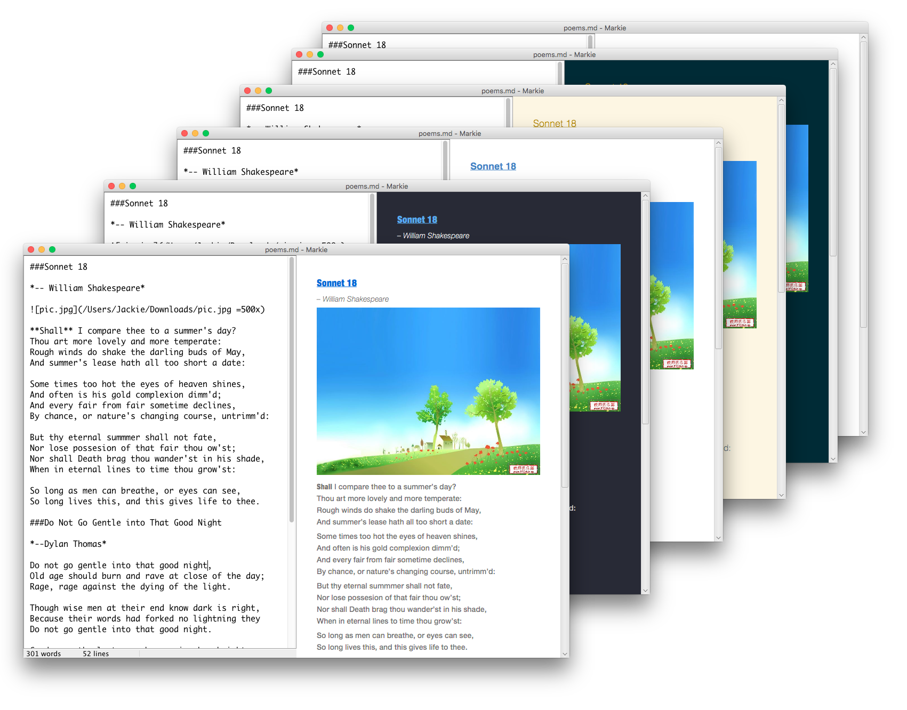
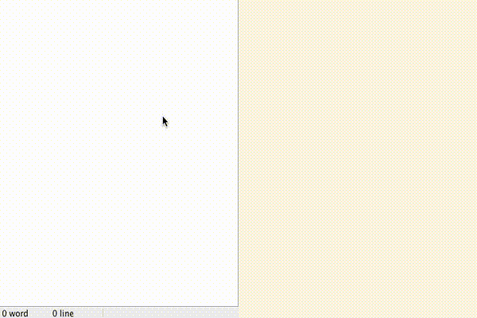
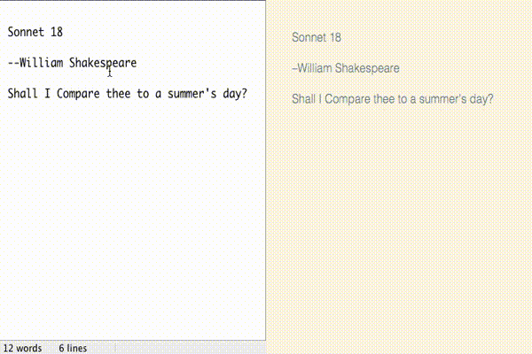
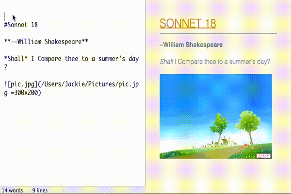
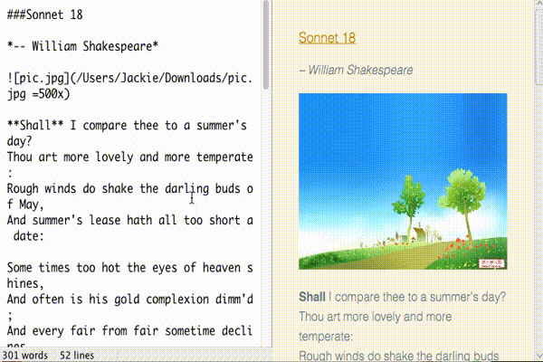
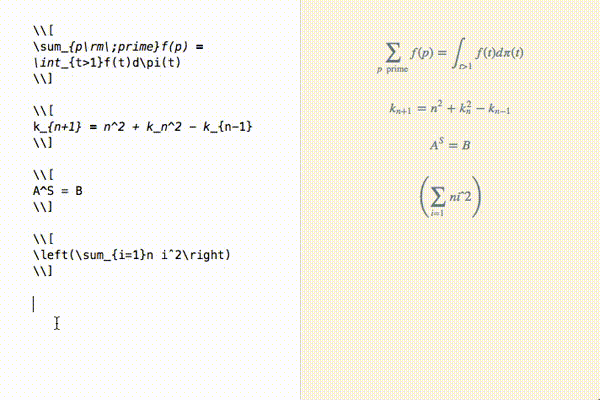
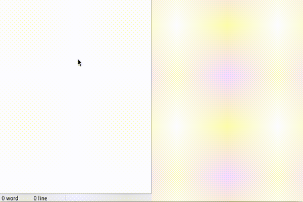
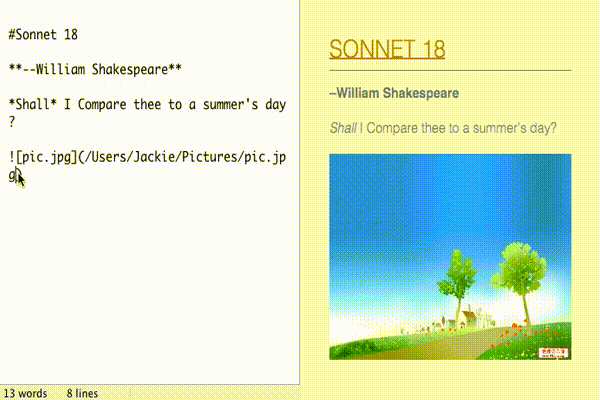
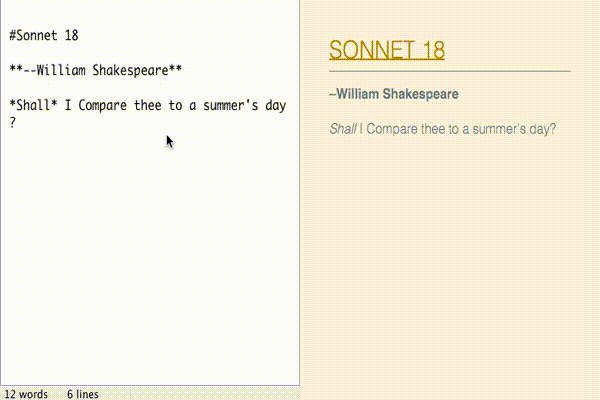
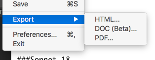

#Markie

a **cross-platform** Markdown editor implemented in Java

##Logo

##UI

##Features

* ### multi theme (RESUME themenew)

* ### full Markdown support

* ### sync scroll

* ### Tex-like math syntax support

* ### table support

* ### image resize syntax support

* ### drag to insert image

* ### export to many formats

##To-DO

* Syntax Highlighting